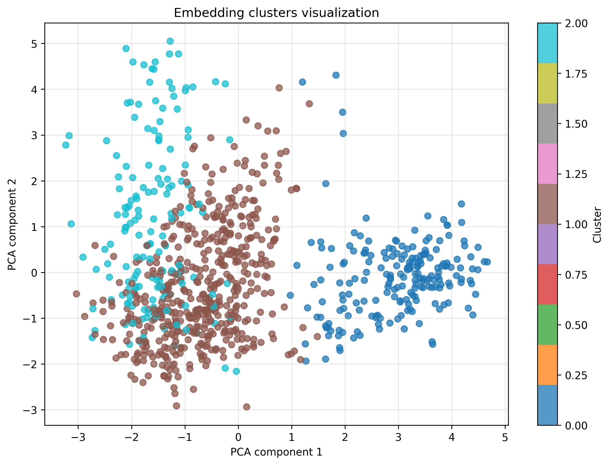
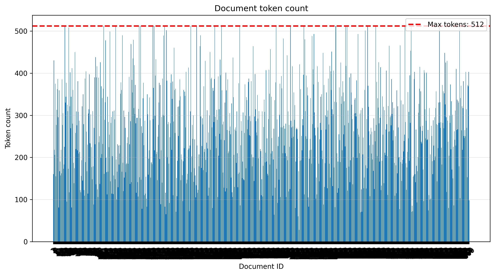
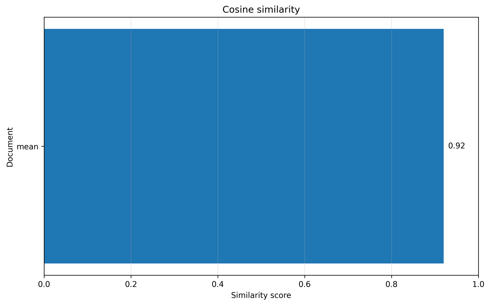

# SolveDesk AI [https://solvedesk-ai.netlify.app/]

Intelligent knowledge base powered by embeddings, vector search and Retrieval-Augmented Generation (RAG).

## Overview

SolveDesk AI is a lightweight open-source framework for building local intelligent knowledge bases. The project provides a command-line interface for creating vector databases, importing documents, generating embeddings, performing semantic search, and integrating with local Large Language Models (LLMs).

Inspired by frameworks such as Laravel and Django, SolveDesk AI simplifies the process of building Retrieval-Augmented Generation (RAG) systems by providing ready-to-use commands and a modular architecture.

The framework can be used both as a production-ready knowledge base solution and as an educational platform for learning modern AI technologies, vector databases, embeddings, and semantic retrieval.

---

## Features

* Local knowledge base creation
* Semantic document search
* Retrieval-Augmented Generation (RAG)
* Vector database management
* Embedding generation
* Local LLM integration through Ollama
* Data synchronization from APIs
* CSV, JSON and XLSX import support
* Embedding quality analysis
* Document chunking
* FastAPI integration
* Command-line interface

---

## Architecture

```text
Documents / API
       │
       ▼
Embedding Model
       │
       ▼
    ChromaDB
       │
       ▼
Semantic Search
       │
       ▼
      LLM
    Ollama
       │
       ▼
 Generated Response
```

---

## Technologies

| Technology               | Purpose                |
| ------------------------ | ---------------------- |
| Python 3.11              | Application runtime    |
| FastAPI                  | REST API               |
| ChromaDB                 | Vector database        |
| silver-retriever-base-v1 | Embedding model        |
| Sentence Transformers    | Embedding generation   |
| Ollama                   | Local LLM integration  |
| Matplotlib               | Data visualization     |
| Typer                    | Command-line interface |

---

## Installation

Install solvedesk:

```bash
venv\Scripts\activate 
(venv) pip install solvedesk-ai
```

---

## CLI Commands

### Project Configuration

```bash
(venv) C:\path\to\project> solvedesk conf init

[INFO] SolveDesk AI - Project Generator

[INPUT] Project name: Test123
[INPUT] Project description [Local RAG knowledge base]:

━━━━━━━━━━━━━━━━━━━━━━━━━━━━━━━━━━━━
[INFO] Configuration
━━━━━━━━━━━━━━━━━━━━━━━━━━━━━━━━━━━━
[DETAILS] Name        : Test123
[DETAILS] Description : Local RAG knowledge base
[DETAILS] Template    : https://github.com/studiocyfrowe/solvedesk-ai

[CONFIRM] Continue project creation? [y/N]: y

[STATUS] Downloading template...

[STATUS] Project created successfully

━━━━━━━━━━━━━━━━━━━━━━━━━━━━━━━━━━━━
[INFO] Project information
━━━━━━━━━━━━━━━━━━━━━━━━━━━━━━━━━━━━
[DETAILS] Location : C:\path\to\project\Test123
[DETAILS] Name     : Test123
[DETAILS] Description : Local RAG knowledge base

━━━━━━━━━━━━━━━━━━━━━━━━━━━━━━━━━━━━
[INFO] Next steps:

cd Test123
solvedesk db init
solvedesk llm init
solvedesk run:app

━━━━━━━━━━━━━━━━━━━━━━━━━━━━━━━━━━━━
[STATUS] Happy coding!
━━━━━━━━━━━━━━━━━━━━━━━━━━━━━━━━━━━━
```

Initialize project environment.

### Database

Initialize vector database:

```bash
(venv) C:\path\to\project> solvedesk db init

[STATUS] Downloading embedding model...
[STATUS] Model downloaded: utils\models\silver-retriever-base-v1
[STATUS] Plik .env already exists - downloading model has been skipped
[STATUS] Created databases directory: utils\databases
[STATUS] Created vector database: utils\databases\default-db
━━━━━━━━━━━━━━━━━━━━━━━━━━━━━━━━━━━━━━━━━
[SUCCESS] SolveDesk vector DB initialized
━━━━━━━━━━━━━━━━━━━━━━━━━━━━━━━━━━━━━━━━━
```

Create vector database and download embedding model.

```bash
(venv) C:\path\to\project> solvedesk db init --chroma-dir test12345

[CONFIRM] Download embedding model (ipipan/silver-retriever-v1)? [y/N]: n
[STATUS] Plik .env already exists - downloading model has been skipped

━━━━━━━━━━━━━━━━━━━━━━━━━━━━━━━━━━━━
[STATUS] Created databases directory: utils\databases
[STATUS] Created vector database: utils\databases\test12345
[STATUS] Vector Database is ready!
━━━━━━━━━━━━━━━━━━━━━━━━━━━━━━━━━━━━
[NEXT STEP] Create new collection: solvedesk db new <collection-name>
```

Display available collections.

```bash
(venv) C:\path\to\project> solvedesk db list

test_col | id=235c239e-421b-4b09-95d2-8a81bbafffd3 | documents=0 | metadata={'hnsw:space': 'cosine'}
sd-collection-8780 | id=d857b0a3-27cc-4a67-8463-4d4d075b00dd | documents=0 | metadata={'hnsw:space': 'cosine'}
```

Create new collection by default

```bash
(venv) C:\path\to\project> solvedesk db new
[STATUS] Created new collection: sd-collection-2132
```

or custom name

```bash
(venv) C:\path\to\project> solvedesk db new --collection-name test-collection
[STATUS] Created new collection: test-collection
```

Delete single collection.

```bash
(venv) C:\path\to\project> solvedesk db delete test123
[STATUS] Collection not found: test123

(venv) C:\path\to\project> solvedesk db delete sd-collection-2132
[STATUS] Collection deleted: sd-collection-2132
```

Display collection details.
```bash
(venv) C:\path\to\project> solvedesk db details test-col123

━━━━━━━━━━━━━━━━━━━━━━━━━━━━━━━━━━━━
COLLECTION DETAILS
━━━━━━━━━━━━━━━━━━━━━━━━━━━━━━━━━━━━

Name: test-col123
ID: 4f9a8b8a-9ac9-48be-8f5a-9fe1e20d4551
[STATUS] Documents (count): 0
[STATUS] Metadata: {'hnsw:space': 'cosine'}

[STATUS] No documents.
```

Switch database

```bash
(venv) C:\path\to\project> solvedesk db checkout test
Switched to database: test
CHROMA_DIR=utils\databases\test
```

### Data Synchronization

Remember to prepare data source!
Example:

```bash
ticketId,ticketName,ticketBody,ticketAnswer
1,Problem z logowaniem,Użytkownik nie może zalogować się do systemu po zmianie hasła.,Należy wyczyścić cache przeglądarki i ponownie ustawić hasło.
2,Błąd płatności,System zwraca błąd 500 podczas finalizacji płatności.,Zweryfikowano integrację z operatorem płatności i zrestartowano usługę.
3,Timeout API,Zapytania do API trwają bardzo długo w godzinach szczytu.,Dodano cache Redis oraz zwiększono liczbę workerów aplikacji.
4,Nieprawidłowe dane,Raport sprzedaży pokazuje błędne wartości dla części zamówień.,Naprawiono mapowanie danych w procesie ETL.
5,Brak powiadomień email,Klienci nie otrzymują wiadomości potwierdzających rejestrację.,Skonfigurowano poprawnie serwer SMTP i kolejkę wiadomości.

(venv) C:\path\to\project> solvedesk sync file "tickets.csv" test133
[ERROR] [ERROR] Unsupported data type. Use: know_base, faq or helpdesk
```

Names of columns should be specified:
```python
if type == "know-base":
    return (
        ["id", "name", "question", "answer"],
        ["name", "question", "answer"]
    )

if type == "faq":
    return (
        ["id", "question", "answer"],
        ["question", "answer"]
    )

if type == "helpdesk":
    return (
        ["id", "title", "problem", "solution"],
        ["title", "problem", "solution"]
    )
```

```bash
(venv) C:\path\to\project> solvedesk sync file "tickets.csv" test133 --type helpdesk

PREPROCESSING SUMMARY

[STATUS] Raw records: 5
[STATUS] Valid records: 5
[STATUS] Rejected records: 0

━━━━━━━━━━━━━━━━━━━━━━━━━━━━━━━━━━━━
CLEAN FILE PREVIEW

[
  {
    "id": 1,
    "title": "Problem z logowaniem",
    "problem": "Użytkownik nie może zalogować się do systemu po zmianie hasła.",
    "solution": "Należy wyczyścić cache przeglądarki i ponownie ustawić hasło."
  },
  {
    "id": 2,
    "title": "Błąd płatności",
    "problem": "System zwraca błąd 500 podczas finalizacji płatności.",
    "solution": "Zweryfikowano integrację z operatorem płatności i zrestartowano usługę."
  },
  {
    "id": 3,
    "title": "Timeout API",
    "problem": "Zapytania do API trwają bardzo długo w godzinach szczytu.",
    "solution": "Dodano cache Redis oraz zwiększono liczbę workerów aplikacji."
  }
]

━━━━━━━━━━━━━━━━━━━━━━━━━━━━━━━━━━━━

[STATUS] Selected data type: helpdesk
[CONFIRM] Do you want to import this cleaned data? [y/N]: y
[STATUS] Imported documents: 5

━━━━━━━━━━━━━━━━━━━━━━━━━━━━━━━━━━━━
[SUCCESS] Documents has been imported!
━━━━━━━━━━━━━━━━━━━━━━━━━━━━━━━━━━━━
```

```bash
(venv) C:\path\to\project> solvedesk sync api
[INPUT] Input external API URL: http://127.0.0.1:8000/data
[INPUT] Type collection name from your vector database: testapi2
[INPUT] Input token for API: secret-token
[INPUT] Specify data type [know-base]: helpdesk

[STATUS] Starting API synchronization...

[STATUS] Imported documents: 869

━━━━━━━━━━━━━━━━━━━━━━━━━━━━━━━━━━━━
[SUCCESS] API Synchronization completed successfully!
━━━━━━━━━━━━━━━━━━━━━━━━━━━━━━━━━━━━
```


### Data Analysis

```bash
(venv) C:\path\to\project> solvedesk data revision testcol --clusters 3

Embedding quality report

Documents count: 869
Embedding size: 768
Mean similarity: 0.9202

Clusters:
Cluster 1: 505 documents
Cluster 0: 202 documents
Cluster 2: 162 documents

Token statistics:
Document 1 | Tokens: 160/512 (31.25%) | Truncated: False | Embedding size: 768
Document 2 | Tokens: 430/512 (83.98%) | Truncated: False | Embedding size: 768
Document 3 | Tokens: 218/512 (42.58%) | Truncated: False | Embedding size: 768
Document 4 | Tokens: 206/512 (40.23%) | Truncated: False | Embedding size: 768
Document 5 | Tokens: 375/512 (73.24%) | Truncated: False | Embedding size: 768
Document 6 | Tokens: 155/512 (30.27%) | Truncated: False | Embedding size: 768
Document 7 | Tokens: 277/512 (54.1%) | Truncated: False | Embedding size: 768
Document 8 | Tokens: 313/512 (61.13%) | Truncated: False | Embedding size: 768
Document 9 | Tokens: 362/512 (70.7%) | Truncated: False | Embedding size: 768
Document 10 | Tokens: 386/512 (75.39%) | Truncated: False | Embedding size: 768
Document 11 | Tokens: 295/512 (57.62%) | Truncated: False | Embedding size: 768
[...]
Document 864 | Tokens: 270/512 (52.73%) | Truncated: False | Embedding size: 768
Document 865 | Tokens: 153/512 (29.88%) | Truncated: False | Embedding size: 768
Document 866 | Tokens: 372/512 (72.66%) | Truncated: False | Embedding size: 768
Document 867 | Tokens: 369/512 (72.07%) | Truncated: False | Embedding size: 768
Document 868 | Tokens: 403/512 (78.71%) | Truncated: False | Embedding size: 768
Document 869 | Tokens: 98/512 (19.14%) | Truncated: False | Embedding size: 768

Charts created:
Clusters: reports\clusters_visualization.png
Token limit: reports\token_limit_chart.png
Cosine similarity: reports\cosine_similarity_progress.png
```
Generate reports containing:

* cosine similarity statistics
* cluster distribution
* token statistics
* PCA visualization





### Chunking

```bash
solvedesk data chunk
```

Split large documents into smaller chunks suitable for RAG systems.

### LLM Configuration

```bash
solvedesk llm init
```

Configure Ollama host and model.

### Run Application

```bash
solvedesk run:app
```

Start FastAPI server.

---

## Supported Data Structures

### FAQ

```json
{
  "question": "How to reset password?",
  "answer": "Use reset password page."
}
```

### Knowledge Base

```json
{
  "name": "VPN Connection",
  "question": "Cannot connect to VPN",
  "answer": "Verify credentials and VPN client configuration."
}
```

---

## Example Workflow

```bash
solvedesk conf init
solvedesk db init
solvedesk sync file
solvedesk data revision
solvedesk llm init
solvedesk run:app
```

---

## Project Goals

* Build local intelligent knowledge bases
* Simplify RAG implementation
* Support AI experimentation
* Provide full control over data
* Enable local LLM deployments
* Offer educational value for learning AI technologies

---

## License

Author: Dominik Hofman [https://www.linkedin.com/in/hofmandesign/]
MIT License